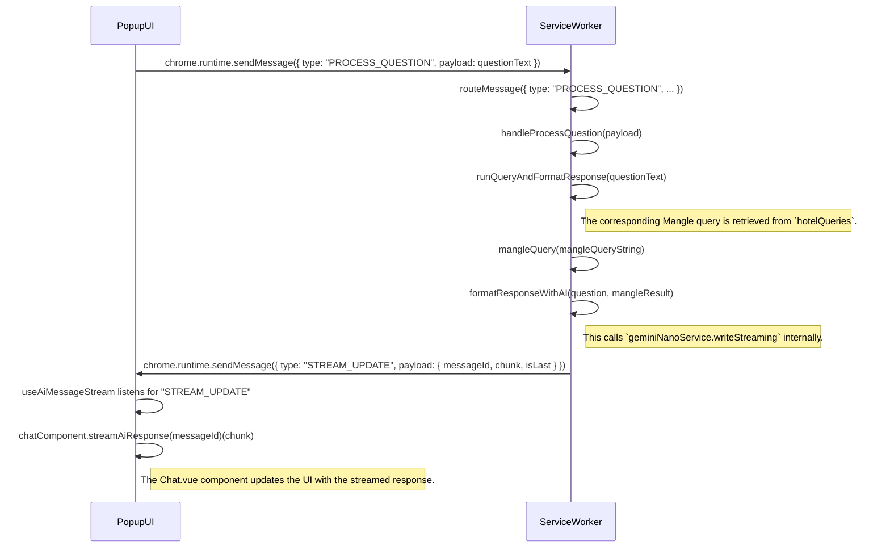

# Chat Flow Diagram

This document outlines the flow of information when a user interacts with the chat feature in the Popup UI. This includes typing a question or clicking on a suggestion chip.

## Sequence Diagram

The following Mermaid.js diagram illustrates the sequence of events and messages passed between the different components of the extension during a chat interaction.

## Detailed Explanation

The chat information flow can be broken down into the following steps:

1.  **User Input**:
    *   The user either types a question into the input field or clicks on a predefined question chip in the `Chat.vue` component.
    *   The `ChatContainer.vue` component's `handleQuestion` method is called with the question text.
    *   A message of type `"PROCESS_QUESTION"` is sent to the service worker with the question text as the payload.
    *   **Files**: `src/popup/components/Chat.vue`, `src/popup/components/ChatContainer.vue`

2.  **Service Worker Routing**:
    *   The service worker's `index.ts` receives the message.
    *   The `routeMessage` function in `router.ts` directs the message to the `handleProcessQuestion` function in `questionHandler.ts`.
    *   **Files**: `src/service-worker-2/index.ts`, `src/service-worker-2/router.ts`

3.  **Question Processing and Mangle Query**:
    *   The `handleProcessQuestion` function calls `runQueryAndFormatResponse` from `hotelDataHandler.ts`.
    *   Inside `runQueryAndFormatResponse`, the `hotelQueries` object is used to find the Mangle query string that corresponds to the user's question.
    *   The `mangleQuery` function is executed with the retrieved query string.
    *   **Files**: `src/service-worker-2/handlers/questionHandler.ts`, `src/service-worker-2/handlers/hotelDataHandler.ts`

4.  **AI Response Generation**:
    *   The result of the Mangle query (or `null` if no result was found) is passed to the standalone `formatResponseWithAI` function.
    *   This function constructs a prompt and a specific `options` object for the Gemini Nano Writer API.
    *   It then calls the generic `geminiNanoService.writeStreaming` method, which uses the `Writer` API (with session caching) to generate a natural language response and stream it back.
    *   As the response is generated, messages of type `"STREAM_UPDATE"` are sent to the Popup UI.
    *   **Files**: `src/service-worker-2/handlers/hotelDataHandler.ts`, `src/service-worker-2/geminiNano/geminiNanoService.ts`

5.  **UI Updates**:
    *   The `useAiMessageStream` composable in `ChatContainer.vue` listens for the `"STREAM_UPDATE"` messages.
    *   It then calls the `streamAiResponse` method on the `Chat.vue` component, which updates the UI in real-time with the incoming text chunks.
    *   **Files**: `src/popup/components/ChatContainer.vue`, `src/popup/composables/useAiMessageStream.ts`, `src/popup/components/Chat.vue`
