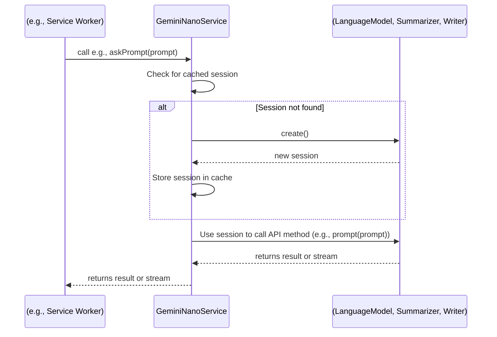
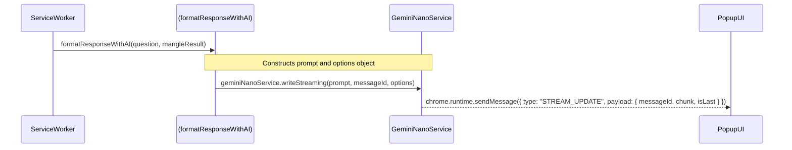

# Gemini API Information Flow Diagrams

This document outlines the various ways the Gemini API is used within this Chrome Extension, illustrating the information flow for each use case.

## Sequence Diagrams

The following Mermaid.js diagrams illustrate the sequence of events and messages passed between the different components of the extension for each Gemini API function.

### 1. `GeminiNanoService` API Interaction (Unified Flow)

All interactions with the Gemini Nano APIs (`LanguageModel`, `Summarizer`, `Writer`) are now managed by the `GeminiNanoService`. This service uses a session caching mechanism to improve performance by reusing session objects.

### 2. `formatResponseWithAI` Flow

This standalone function generates a natural language response from a Mangle query result. It now calls the generic `writeStreaming` method on the `GeminiNanoService`.

