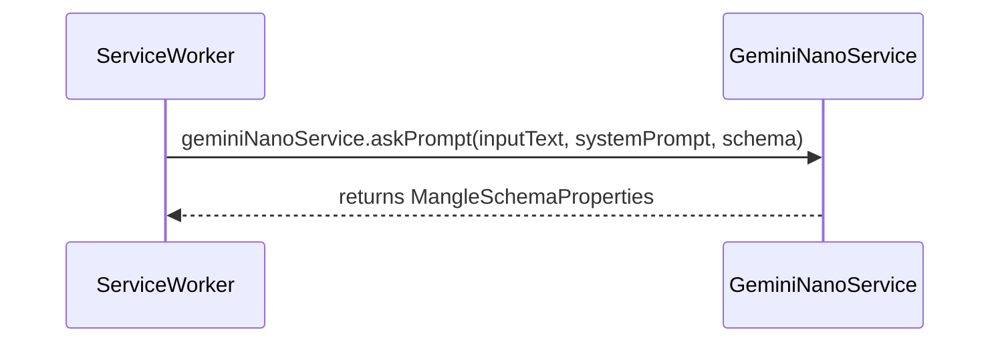
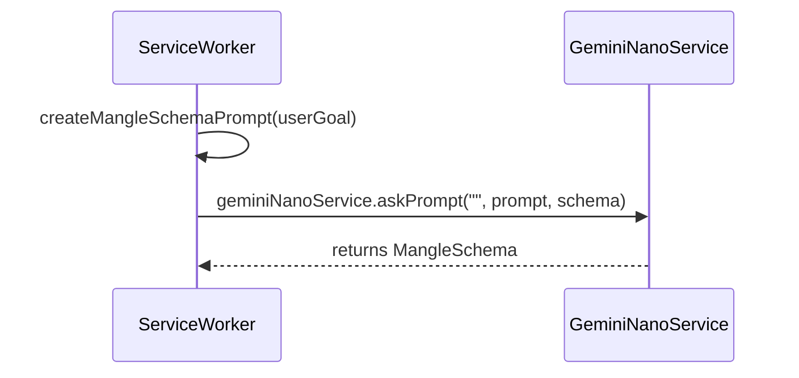
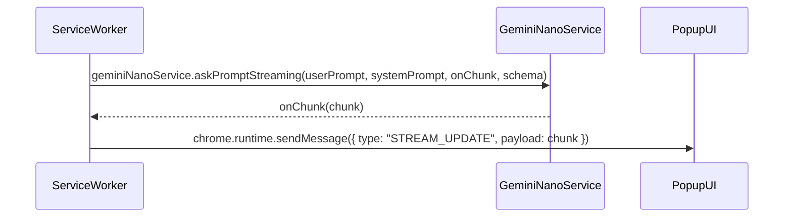
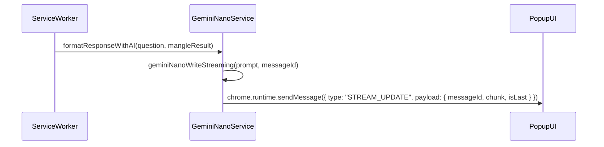
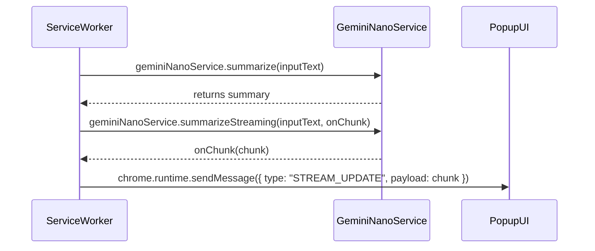

# Gemini API Information Flow Diagrams

This document outlines the various ways the Gemini API is used within this Chrome Extension, illustrating the information flow for each use case.

## Sequence Diagrams

The following Mermaid.js diagrams illustrate the sequence of events and messages passed between the different components of the extension for each Gemini API function.

### 1. `askPrompt` for Mangle Properties

This function is used to extract Mangle properties from a given text.

### 2. `askPrompt` for Mangle Schema Generation

This function is used to generate a Mangle schema based on a user's goal.

### 3. `askPromptStreaming`

This function is used for streaming prompts to the Gemini API.

### 4. `formatResponseWithAI` (using `geminiNanoWriteStreaming`)

This function is used to generate a natural language response from a Mangle query result.

### 5. `summarize` and `summarizeStreaming`

These functions are used to summarize a given text.

