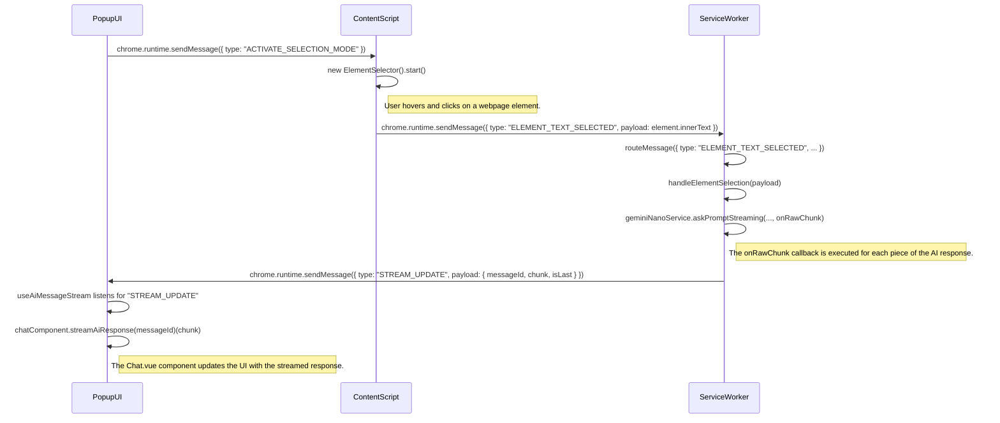

# Information Flow Diagram

This document outlines the flow of information between the Popup UI, the Content Script, and the Service Worker in this Chrome Extension. The primary user story involves selecting an element on a webpage, processing its content using an AI model, and displaying the result in the extension's UI.

## Sequence Diagram

The following Mermaid.js diagram illustrates the sequence of events and messages passed between the different components of the extension.

## Detailed Explanation

The information flow can be broken down into the following steps:

1.  **Activation of Selection Mode**:
    *   The user initiates the element selection process from the Popup UI.
    *   The `usePageAttachment` composable in the popup sends a message of type `"ACTIVATE_SELECTION_MODE"` to the content script.
    *   **File**: `src/popup/composables/usePageAttachment.ts`

2.  **Element Selection**:
    *   The `content-script.ts` listens for the `"ACTIVATE_SELECTION_MODE"` message and instantiates the `ElementSelector` class.
    *   The `ElementSelector` adds event listeners to the webpage, highlighting elements on mouseover.
    *   When the user clicks on an element, the `handleClick` method captures the element's `innerText`.
    *   A message of type `"ELEMENT_TEXT_SELECTED"` is sent to the service worker with the selected text as the payload.
    *   **Files**: `src/content-script.ts`, `src/element-selector.ts`

3.  **Service Worker Processing**:
    *   The service worker's main entry point, `index.ts`, listens for messages from other parts of the extension.
    *   The `routeMessage` function in `router.ts` directs the message to the appropriate handler based on its type.
    *   For `"ELEMENT_TEXT_SELECTED"`, the message is routed to the `handleElementSelection` function in `elementSelectionHandler.ts`.
    *   **Files**: `src/service-worker-2/index.ts`, `src/service-worker-2/router.ts`

4.  **AI Interaction and Streaming**:
    *   The `handleElementSelection` function calls the `geminiNanoService.askPromptStreaming` method, passing the selected text and an `onRawChunk` callback.
    *   This service makes a request to the Gemini Nano API.
    *   As the AI model generates the response, the `onRawChunk` callback is invoked with chunks of the response.
    *   Inside the callback, a message of type `"STREAM_UPDATE"` is sent to the Popup UI, containing the chunk of text, a unique `messageId`, and a boolean `isLast` indicating if it's the final chunk.
    *   **Files**: `src/service-worker-2/handlers/elementSelectionHandler.ts`, `src/service-worker-2/geminiNano/geminiNanoService.ts`

5.  **UI Updates**:
    *   The `ChatContainer.vue` component in the popup uses the `useAiMessageStream` composable to listen for `"STREAM_UPDATE"` messages.
    *   When a message is received, the composable calls the `streamAiResponse` method on the `Chat.vue` component.
    *   The `streamAiResponse` method finds the corresponding message in the chat history by its `messageId` and appends the new text chunk to it, creating a real-time streaming effect in the UI.
    *   **Files**: `src/popup/components/ChatContainer.vue`, `src/popup/composables/useAiMessageStream.ts`, `src/popup/components/Chat.vue`
